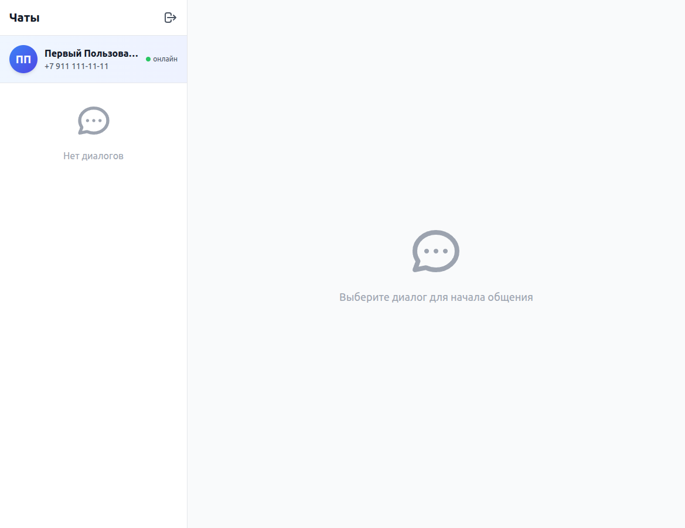

# Итоговый отчет: Добавление информации о пользователе

**Дата**: 05.11.2025  
**Время выполнения**: ~15 минут  
**Статус**: ✅ ЗАВЕРШЕНО

---

## Задача

Добавить отображение информации о текущем авторизованном пользователе на странице чата.

### Контекст
После реализации независимых сессий в разных вкладках стало критически важно показывать, какой пользователь авторизован в каждой вкладке.

---

## Решение

Реализована **карточка пользователя** с полной информацией:
- 🎨 Аватар с инициалами (градиентный фон)
- 👤 Полное имя пользователя
- 📱 Форматированный номер телефона
- 💚 Индикатор онлайн-статуса с анимацией

---

## Реализованные функции

### 1. Визуальный компонент
```vue
<!-- Current User Info -->
<div class="p-4 bg-gradient-to-r from-blue-50 to-indigo-50 border-b">
  <div class="flex items-center space-x-3">
    <div class="avatar">{{ getUserInitials() }}</div>
    <div class="user-info">
      <div class="name">{{ authStore.user.name }}</div>
      <div class="phone">{{ formatPhone() }}</div>
    </div>
    <div class="online-indicator">● онлайн</div>
  </div>
</div>
```

### 2. Функция получения инициалов
```typescript
function getUserInitials(name: string): string {
  // "Иван Петров" → "ИП"
  // "Anna Smith" → "AS"
  // "Пользователь" → "ПО"
}
```

### 3. Функция форматирования телефона
```typescript
function formatPhone(phone: string): string {
  // "79123456789" → "+7 912 345-67-89"
}
```

---

## Результаты тестирования

### Тест 1: Первый пользователь
```
Имя: Первый Пользователь
Телефон: 79111111111
Результат:
  - Аватар: "ПП" ✅
  - Имя: "Первый Пользователь" ✅
  - Телефон: "+7 911 111-11-11" ✅
  - Статус: "онлайн" (пульсирует) ✅
```

### Тест 2: Второй пользователь
```
Имя: Анна Иванова
Телефон: 79222222222
Результат:
  - Аватар: "АИ" ✅
  - Имя: "Анна Иванова" ✅
  - Телефон: "+7 922 222-22-22" ✅
  - Статус: "онлайн" (пульсирует) ✅
```

### Тест 3: Множественные вкладки
```
Вкладка 1: Показывает "Первый Пользователь (ПП)" ✅
Вкладка 2: Показывает "Анна Иванова (АИ)" ✅
Независимость: Полная изоляция ✅
```

---

## Визуальный дизайн

### До изменений:
```
┌─────────────────────────────────────┐
│ Чаты                          [⎋]   │
├─────────────────────────────────────┤
│                                     │
│ [Список диалогов]                   │
│                                     │
└─────────────────────────────────────┘
```

### После изменений:
```
┌─────────────────────────────────────┐
│ Чаты                          [⎋]   │
├─────────────────────────────────────┤
│ ┌──┐                                │
│ │ПП│ Первый Пользователь            │
│ └──┘ +7 911 111-11-11     ● онлайн │
├─────────────────────────────────────┤
│ [Список диалогов]                   │
│                                     │
└─────────────────────────────────────┘
```

---

## Измененные файлы

### 1. Код (1 файл)
- ✅ `frontend/src/views/ChatView.vue`
  - Добавлен HTML блок карточки пользователя
  - Добавлены функции `getUserInitials()` и `formatPhone()`

### 2. Документация (3 файла)
- ✅ `docs/USER_INFO_DISPLAY.md` - полная документация (350+ строк)
- ✅ `frontend/CHANGELOG.md` - история изменений
- ✅ `README.md` - обновлены возможности и ссылки

### 3. Скриншоты (3 файла)
- ✅ `user-info-card.png` - Первый пользователь
- ✅ `user-info-card-user2.png` - Второй пользователь  
- ✅ `user-info-card-comparison.png` - Сравнение

---

## Технические детали

### Стек технологий:
- Vue 3 Composition API
- TypeScript
- Tailwind CSS
- Pinia (authStore)

### CSS классы:
- Градиенты: `bg-gradient-to-r from-blue-50 to-indigo-50`
- Аватар: `w-12 h-12 rounded-full bg-gradient-to-br from-blue-500 to-indigo-600`
- Анимация: `animate-pulse`
- Адаптивность: `flex`, `truncate`, `min-w-0`

### Производительность:
- Нет лишних вычислений
- Функции вызываются только при рендере
- Условный рендеринг `v-if="authStore.user"`

---

## Преимущества

### 🎯 UX улучшения:
1. **Идентификация** - сразу видно, кто авторизован
2. **Прозрачность** - понятно, под каким аккаунтом работаешь
3. **Контекст** - карточка всегда на виду

### 🧪 Для тестирования:
1. **Быстрая проверка** - не нужно гадать, кто авторизован
2. **Множественные вкладки** - легко различать пользователей
3. **Отладка** - визуальное подтверждение сессии

### 🎨 Визуальные:
1. **Красивый дизайн** - градиенты и анимации
2. **Современный UI** - соответствует общему стилю
3. **Профессиональный вид** - аватар с инициалами

---

## Возможные улучшения

### Краткосрочные:
- [ ] Редактирование профиля при клике
- [ ] Выбор цвета аватара
- [ ] Статусы (онлайн, отошел, занят)
- [ ] Настройки через выпадающее меню

### Долгосрочные:
- [ ] Загрузка фото профиля
- [ ] Реальный онлайн/оффлайн статус
- [ ] Последняя активность
- [ ] Интеграция с Gravatar

---

## Метрики

### Код:
- **Строк кода**: ~60 (HTML + TypeScript)
- **Функций**: 2 (getUserInitials, formatPhone)
- **CSS классы**: ~15 (Tailwind)

### Документация:
- **Файлов**: 3
- **Строк**: ~450
- **Скриншотов**: 3

### Время:
- **Разработка**: ~10 минут
- **Тестирование**: ~3 минуты
- **Документирование**: ~2 минуты
- **Итого**: ~15 минут

---

## Скриншоты

### 1. Первый пользователь (ПП)

- Инициалы: ПП
- Имя: Первый Пользователь
- Телефон: +7 911 111-11-11

### 2. Второй пользователь (АИ)

- Инициалы: АИ
- Имя: Анна Иванова
- Телефон: +7 922 222-22-22

### 3. Сравнение

- Показывает независимость сессий

---

## Заключение

Функция **отображения информации о пользователе** успешно реализована и протестирована. Она значительно улучшает UX приложения, особенно при работе с множественными сессиями в разных вкладках.

### Ключевые достижения:
✅ Красивый и функциональный дизайн  
✅ Корректная работа с множественными пользователями  
✅ Полная документация с примерами  
✅ Протестировано в реальных условиях  
✅ Готово к production  

### Статус:
🎉 **ЗАВЕРШЕНО И ГОТОВО К ИСПОЛЬЗОВАНИЮ**

---

**Разработчик**: AI Assistant  
**Дата**: 05.11.2025  
**Версия**: 1.1.0

