# Архитектура Приложения

Комплексное описание архитектуры чат-приложения с интеграцией Chat3 API.

## Оглавление

- [Общая архитектура](#общая-архитектура)
- [Компоненты системы](#компоненты-системы)
- [Потоки данных](#потоки-данных)
  - [Авторизация](#поток-авторизации)
  - [Отправка сообщений](#поток-отправки-сообщений)
  - [Получение обновлений](#поток-получения-обновлений)
  - [WebSocket коммуникация](#websocket-коммуникация)
- [Архитектура бэкенда](#архитектура-бэкенда)
- [Модели данных](#модели-данных)
- [Безопасность](#безопасность)

---

## Общая архитектура

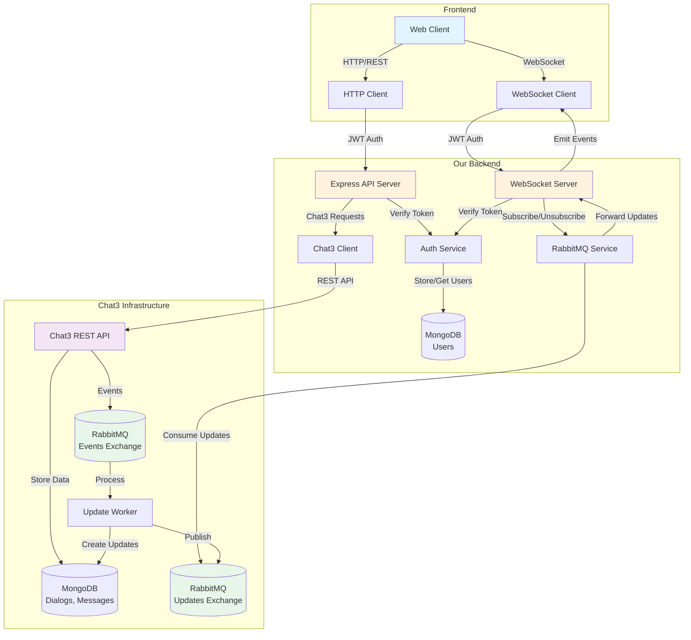

---

## Компоненты системы

### Frontend (Клиент)
- **Web Client** - пользовательский интерфейс
- **WebSocket Client** - real-time подключение для обновлений
- **HTTP Client** - REST API запросы

### Our Backend
| Компонент | Описание | Технология |
|-----------|----------|------------|
| **Express API** | REST API сервер | Express.js |
| **WebSocket Server** | Real-time сервер | Socket.io |
| **Auth Service** | Авторизация пользователей | JWT |
| **Chat3 Client** | Клиент для Chat3 API | Axios |
| **RabbitMQ Service** | Получение обновлений | amqplib |
| **MongoDB** | База пользователей | Mongoose |

### Chat3 Infrastructure
| Компонент | Описание |
|-----------|----------|
| **Chat3 API** | Управление диалогами и сообщениями |
| **Update Worker** | Обработка событий и создание updates |
| **MongoDB** | Хранение диалогов, сообщений, updates |
| **RabbitMQ Events** | Exchange для событий системы |
| **RabbitMQ Updates** | Exchange для персонализированных обновлений |

---

## Потоки данных

### Поток авторизации

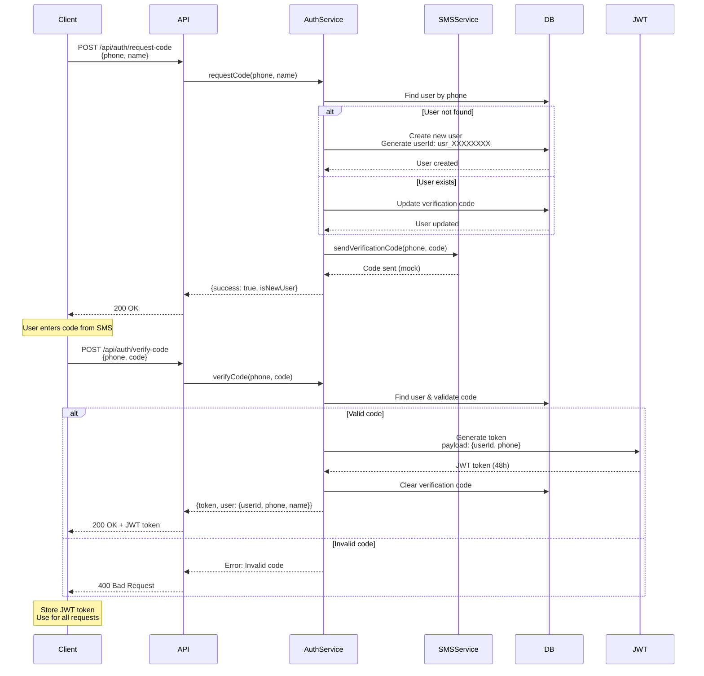

### Поток отправки сообщений

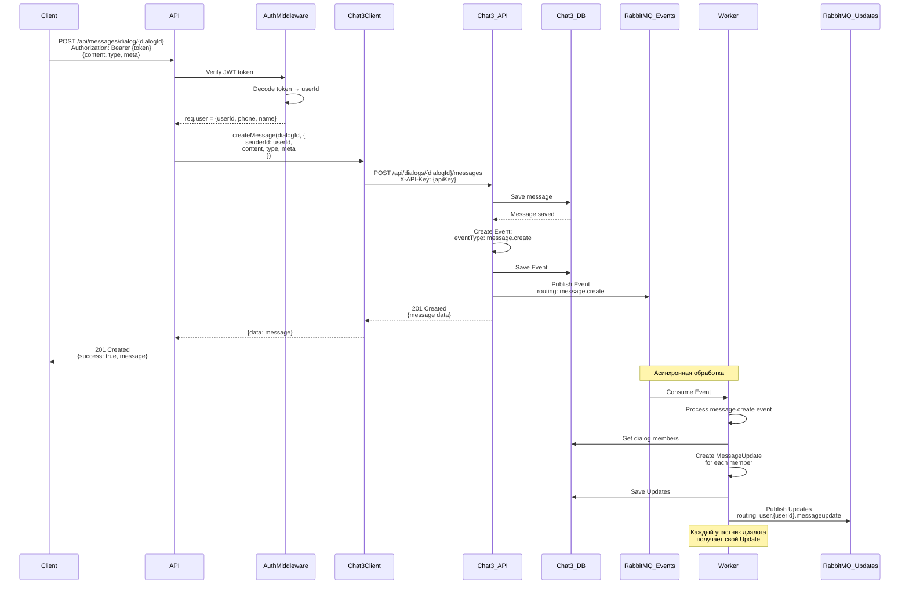

### Поток получения обновлений

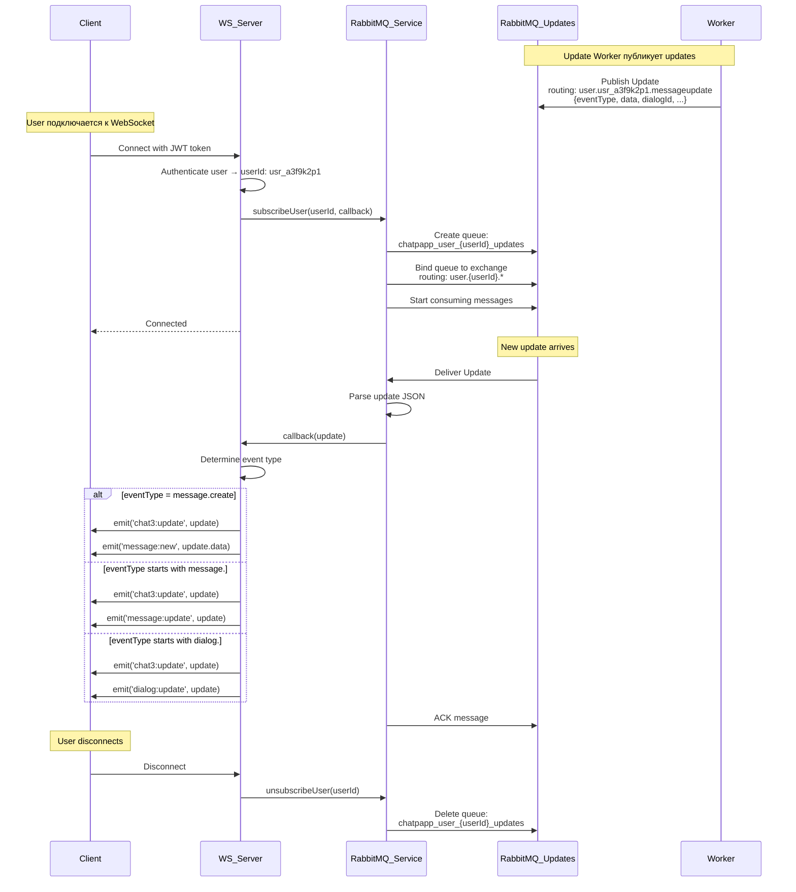

### WebSocket коммуникация

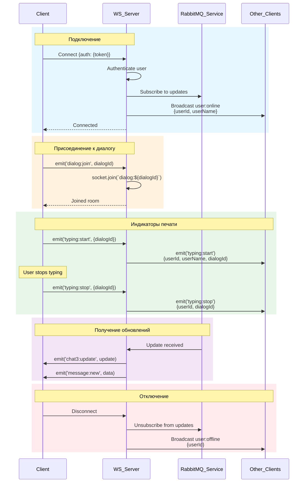

---

## Архитектура бэкенда

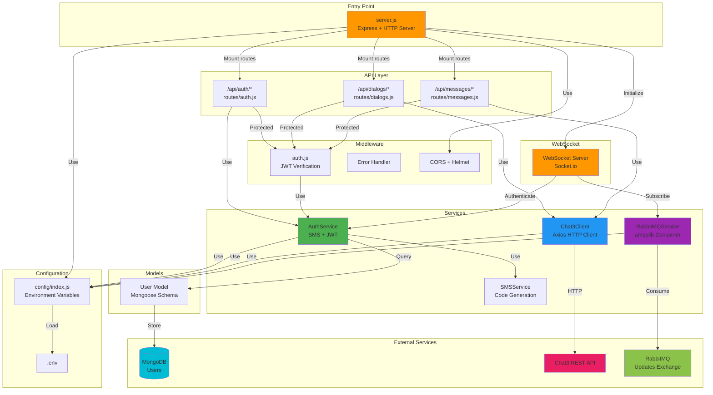

### Структура директорий

```
backend/
├── server.js                 # Точка входа, инициализация сервера
├── src/
│   ├── config/
│   │   └── index.js         # Конфигурация из .env
│   ├── db/
│   │   └── index.js         # MongoDB подключение
│   ├── models/
│   │   └── User.js          # Mongoose модель User
│   ├── services/
│   │   ├── AuthService.js   # Логика авторизации
│   │   ├── SMSService.js    # Отправка SMS (mock)
│   │   ├── Chat3Client.js   # HTTP клиент для Chat3
│   │   └── RabbitMQService.js # RabbitMQ consumer
│   ├── routes/
│   │   ├── auth.js          # Эндпоинты авторизации
│   │   ├── dialogs.js       # Эндпоинты диалогов
│   │   └── messages.js      # Эндпоинты сообщений
│   ├── middleware/
│   │   └── auth.js          # JWT middleware
│   └── websocket/
│       └── index.js         # WebSocket сервер
├── docs/
│   └── RABBITMQ_INTEGRATION.md
├── migrations/
│   └── add-userId.js        # Миграция userId
└── .env                     # Переменные окружения
```

---

## Модели данных

### User (MongoDB - Our Database)

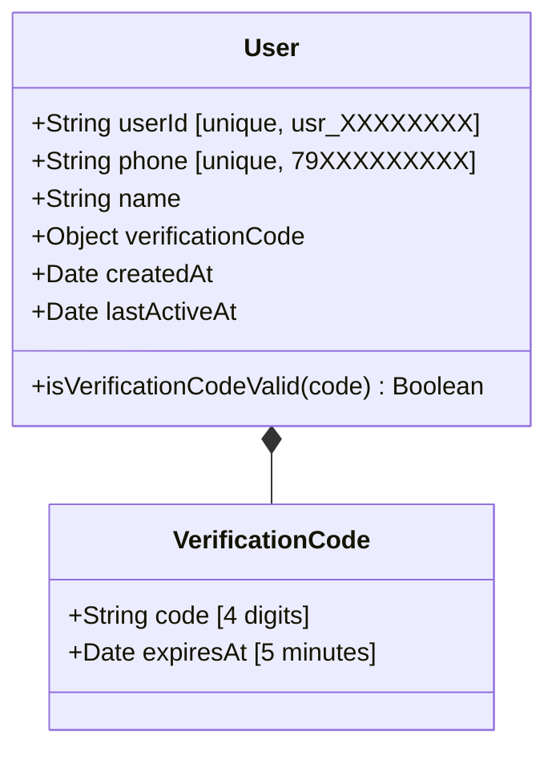

### Chat3 Data Models (Chat3 Database)

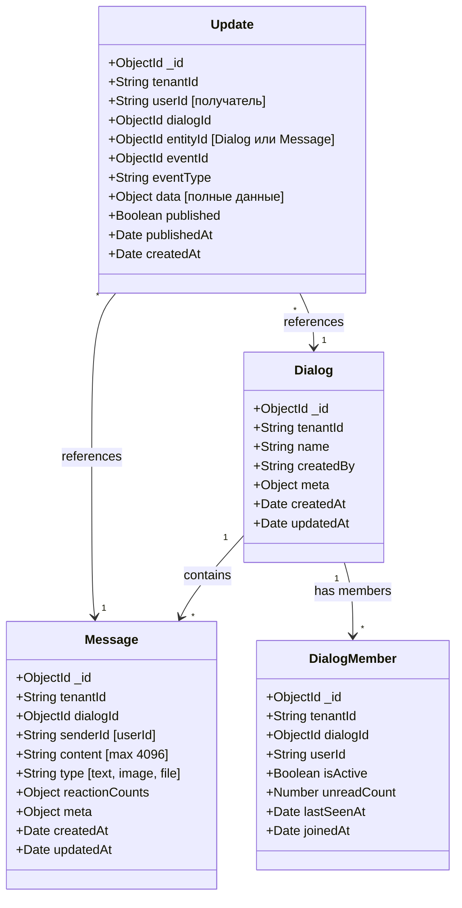

---

## Безопасность

```mermaid
graph TB
    subgraph "Authentication Flow"
        A1[Client Request] -->|Include JWT| A2[API Endpoint]
        A2 -->|Extract Token| A3[Auth Middleware]
        A3 -->|Verify| A4{Valid?}
        A4 -->|Yes| A5[Decode userId]
        A4 -->|No| A6[401 Unauthorized]
        A5 -->|Attach to req.user| A7[Route Handler]
    end
    
    subgraph "JWT Token"
        J1[Payload]
        J2[userId: usr_XXXXXXXX]
        J3[phone: 79XXXXXXXXX]
        J4[Expiry: 48 hours]
        
        J1 --> J2
        J1 --> J3
        J1 --> J4
    end
    
    subgraph "RabbitMQ Security"
        R1[User connects to WebSocket]
        R2[JWT Authentication]
        R3[Extract userId]
        R4[Create personal queue]
        R5[Bind to user.userId.*]
        R6[User receives only their updates]
        
        R1 --> R2
        R2 --> R3
        R3 --> R4
        R4 --> R5
        R5 --> R6
    end
    
    style A6 fill:#ff5252
    style A7 fill:#4caf50
    style R6 fill:#4caf50
```

### Уровни безопасности

| Уровень | Механизм | Описание |
|---------|----------|----------|
| **Transport** | HTTPS/WSS | Шифрование соединения (production) |
| **Authentication** | JWT | Токены с подписью и временем жизни |
| **Authorization** | Middleware | Проверка токена на каждом запросе |
| **User Isolation** | userId | Каждый пользователь видит только свои данные |
| **RabbitMQ** | Routing Keys | `user.{userId}.*` - персональные очереди |
| **Chat3 API** | API Key | Защита запросов к Chat3 |

---

## Полный жизненный цикл сообщения

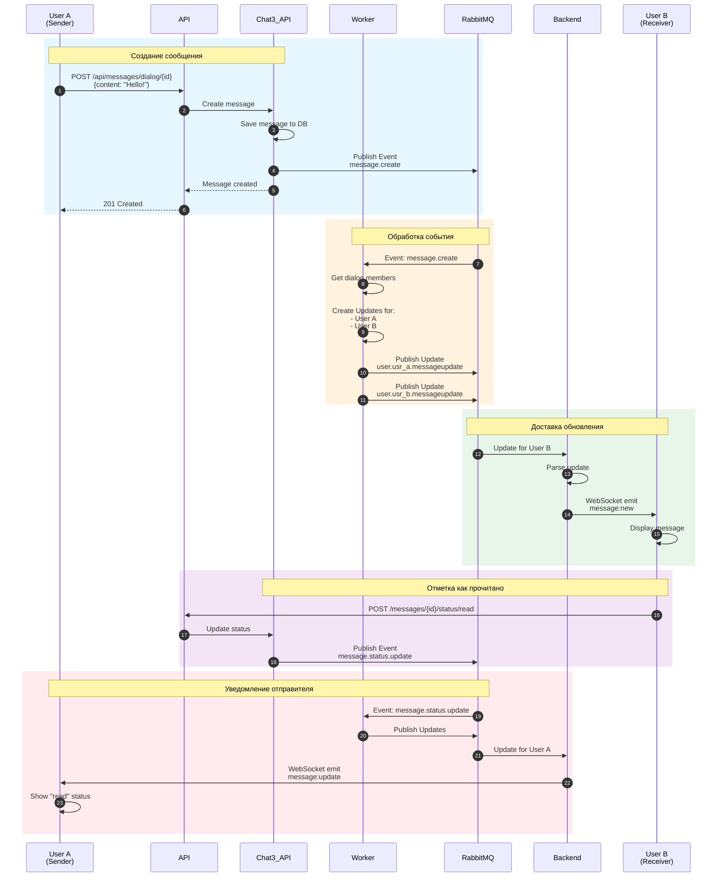

---

## Масштабирование

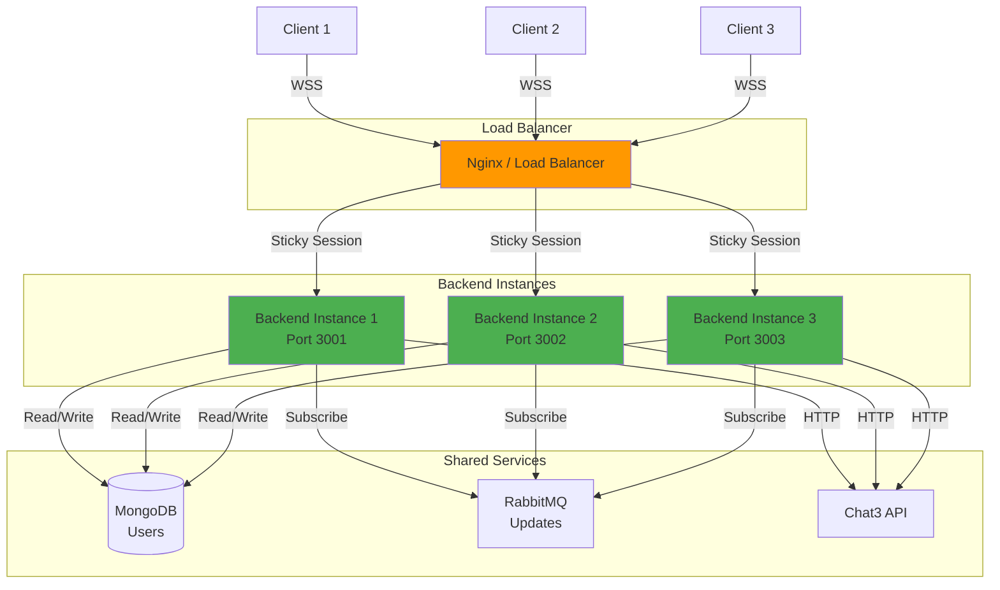

### Особенности горизонтального масштабирования

1. **WebSocket** - sticky sessions для сохранения соединения с одним экземпляром
2. **RabbitMQ** - каждый экземпляр создает свои очереди для подключенных пользователей
3. **MongoDB** - shared database для всех экземпляров
4. **Stateless** - каждый запрос независим благодаря JWT

---

## Мониторинг и метрики

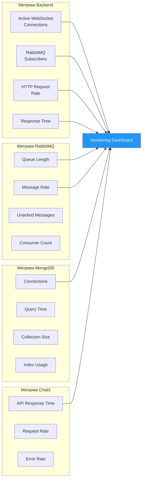

---

## Обработка ошибок

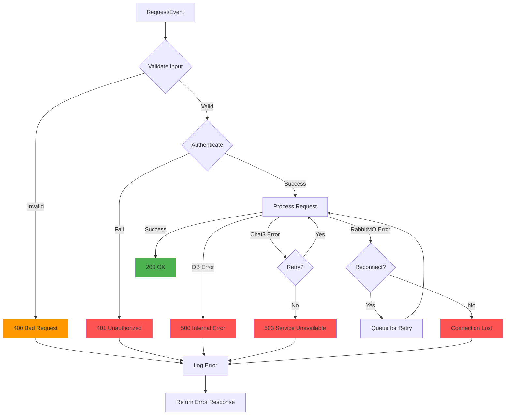

---

## Deployment архитектура

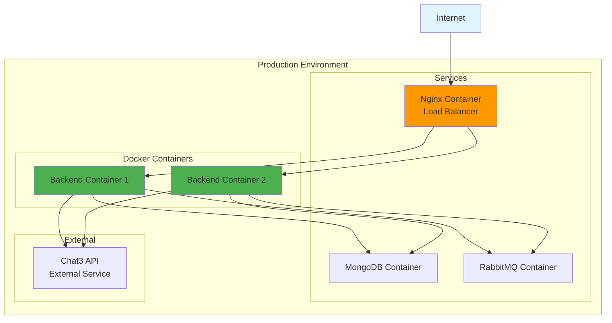

### Docker Compose Example

```yaml
services:
  backend:
    image: chatapp-backend:latest
    replicas: 2
    environment:
      - MONGODB_URI=mongodb://mongo:27017/chatpapp
      - RABBITMQ_URL=amqp://rabbitmq:5672
      - CHAT3_API_URL=https://chat3.external.com/api
    depends_on:
      - mongo
      - rabbitmq

  mongo:
    image: mongo:7
    volumes:
      - mongo_data:/data/db

  rabbitmq:
    image: rabbitmq:3-management
    volumes:
      - rabbitmq_data:/var/lib/rabbitmq

  nginx:
    image: nginx:alpine
    ports:
      - "80:80"
      - "443:443"
    depends_on:
      - backend
```

---

## Заключение

Архитектура приложения построена на следующих принципах:

✅ **Модульность** - четкое разделение компонентов и ответственности  
✅ **Масштабируемость** - горизонтальное масштабирование через Load Balancer  
✅ **Надежность** - graceful shutdown, reconnection, error handling  
✅ **Безопасность** - JWT, user isolation, routing keys  
✅ **Real-time** - WebSocket + RabbitMQ для мгновенных обновлений  
✅ **Интеграция** - seamless работа с Chat3 API  

---

**Версия:** 1.0  
**Дата:** 2025-11-04  
**Автор:** ChatApp Team

